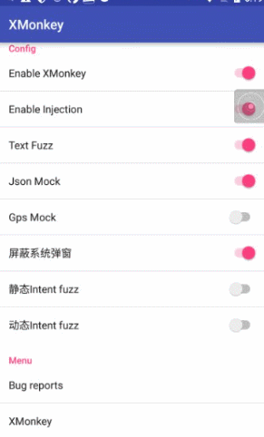

# XMonkey 

> 基于Xposed Hook 做有效的 fuzz 、mock 同时结合Android Monkey，适用于真机/模拟器的APP 容错测试
https://testerhome.com/topics/14804

# 安装
* 安装xposed installer及xmonkey apk，并激活xmonkey

# 功能
0. Monkey
  开启 Enable XMonkey
  悬浮窗点击启动开始时 自动跑Monkey，再次点开悬浮窗暂停跑Monkey。Monkey过程中屏蔽点状态栏，切出app会主动切回

1. Provider Mock
  开启 Enable Inject
  对ContentProvider接口进行hook，根据传入的uri类型进行对应的伪造以及null。如image、audio
 
2. Json Fuzz 
  开启 Enable Inject 、Json Mock
  对HttpURLConnectionImpl及okhttp3的OkHttpClient 进行hook，对服务端返回做延迟、非json、空json、null、xss等fuzz（支持https）

3. Text Fuzz
  开启 Text Fuzz
  对界面中控件遍历，对edit的控件进行fuzz 填充，如非法字符、超长、空string、null、xss等

4. Gps Mock
  开启 Gps Mock （该功能与Json Mock 可能冲突，故需关闭Json Mock）
  对Gps相关模块进行hook 并返回伪造的location

5. 静态Intent Fuzz
  开启 静态Intent Fuzz （该功能与 动态Intent Fuzz 冲突，仅启用之一）
  start test后对所有exported的组件遍历进行intent fuzz攻击，如null、非法序列化Intent等
  静态Intent fuzz过程中，无需手工或monkey操作，等待 弹出 fuzz over提示时表示完成测试。（测试过程中可能会引起多次崩溃）

6. 动态Intent Fuzz 
  开启 动态Intent Fuzz （该功能与 静态Intent Fuzz 冲突）
  运行时hook Intent、bundle组件相关接口，实现运行过程中劫持并畸变intent，如空、非法、null、空数组、非法序列等

# changelog

## 20180625 
  支持Provider、Json、Text、Gps、Intent 等Fuzz测试， 与monkey UI自动化结合
 

## 1. Installation

- need xposed installer

## 2. Usage 
0. Monkey
  Enable XMonkey
  Click on the start of the popupWindow to automatically run Monkey, once again open the popupWindow to stop running Monkey. Monkey mask process status bar, cut out the app will automatically switch back

1. Provider Mock
  Enable Inject
  Hook the ContentProvider interface and perform corresponding mock value and null based on the passed URI type. Like image, audio
 
2. Json Fuzz 
  Enable Inject 、Json Mock
  HttpURLConnectionImpl and okhttp3 OkHttpClient hook, return to the server to do delay, non-json, empty json, null, xss and other fuzz (support https)

3. Text Fuzz
  EnableText Fuzz
  Controls the traversal of the controls in the interface and fuzzes the edit controls, such as illegal characters, long strings, empty strings, nulls, xss, etc.

4. Gps Mock
  Enable Gps Mock （disable Json Mock）
  Hook the Gps related module and return the faked location

5. static Intent Fuzz
  Enable static Intent Fuzz （disable dynamics Intent Fuzz）
  After the start test, all exported components are traversed in intent fuzz attacks, such as null, illegal serialization Intent, etc.
  In the static Intent fuzz process, manual or monkey operations are not required. When the "fuzz over" toast , the test is completed. (may cause multiple crashes during testing)

6. dynamics Intent Fuzz 
  Enable dynamics Intent Fuzz （disable static Intent Fuzz）
  Runtime hook Intent, bundle interfaces, hijack and distort intent during operation, such as null, illegal, null, empty array, illegal sequence, etc.

